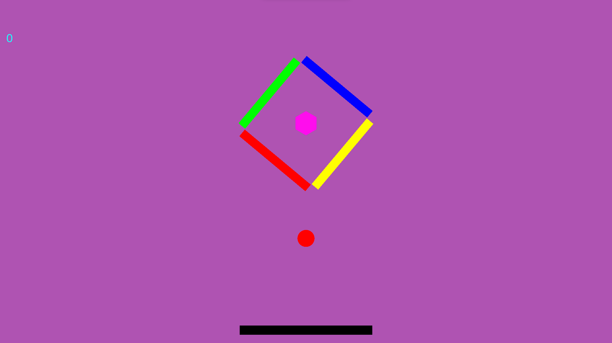

# ColorSwitch
> [Description](#description) | [Install](#install) | [Release](#download-the-latest-release) | [Screenshot Demo](#screenshot) | [Main Features include](#main-features-include) | [Tutorial](#tutorial)
## Description:
- A game made by Unity engine (C#)
> [_Video-Demo_](https://youtu.be/VX2sFHxyam0)
## Install:
```bash
git clone https://github.com/Meoleodeo/ColorSwitch
echo thanks
```
## Screenshot:


## Main Features include:
- update later
## Tutorial:
- Press Space_key: jump


